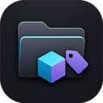
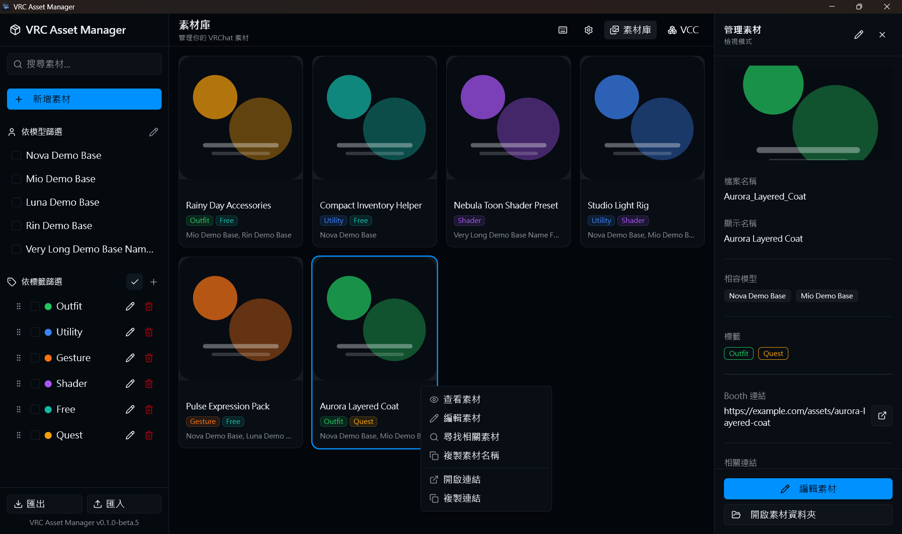
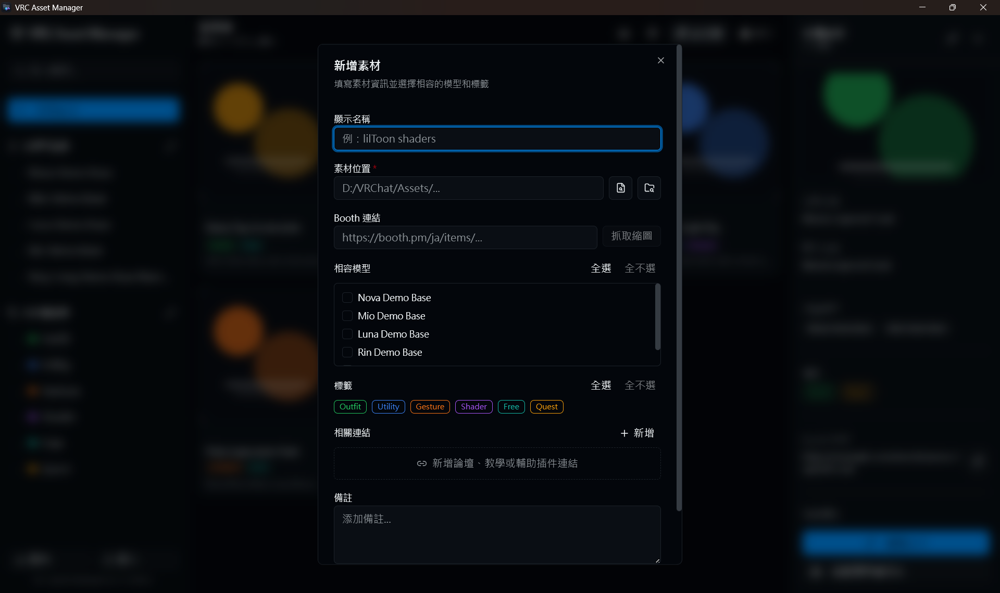
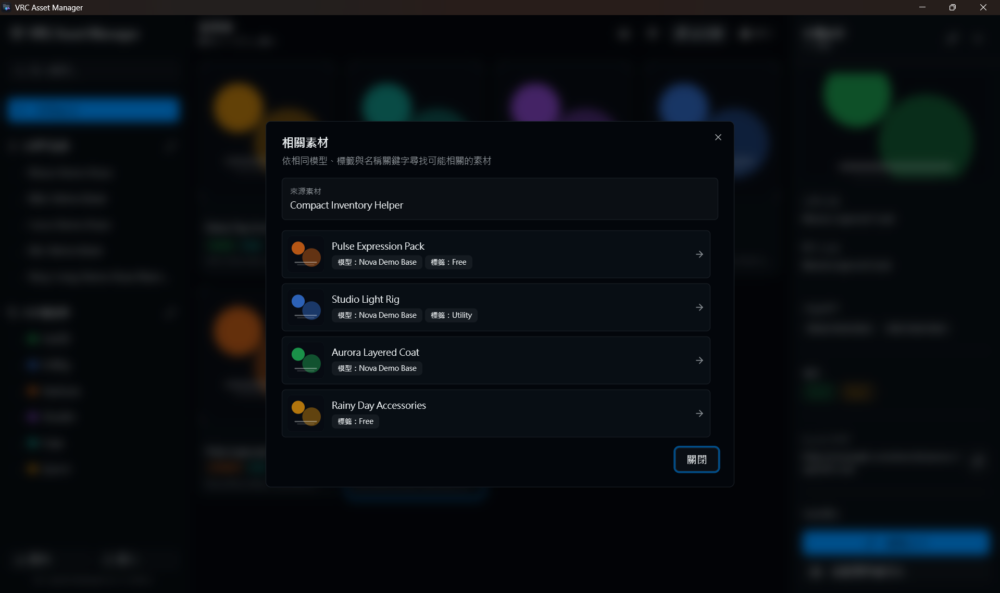
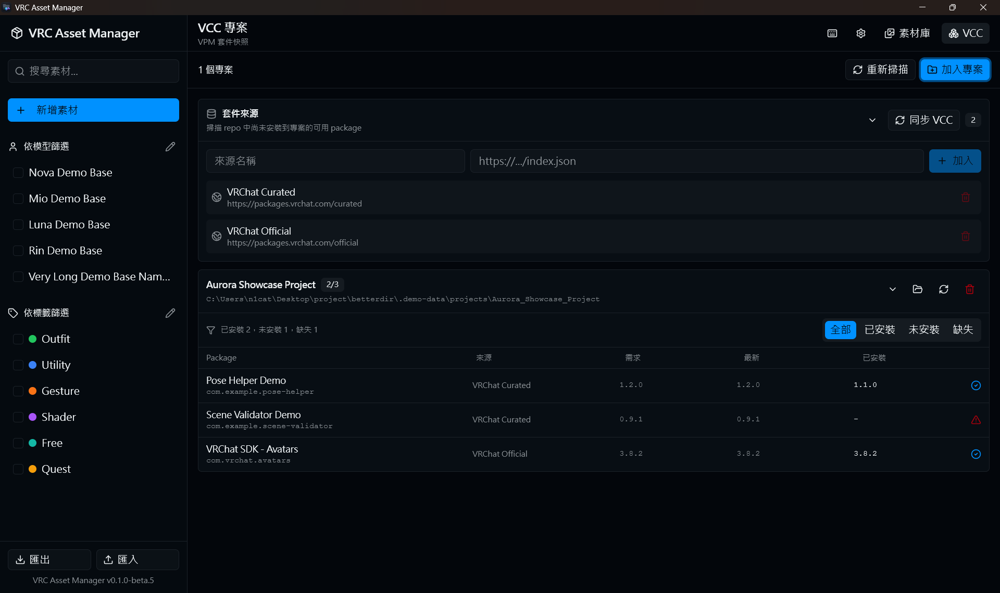

# VRC Asset Manager

<p align="center">
  
</p>

<h3 align="center">為 VRChat 創作者設計的本機素材管理工具</h3>

<p align="center">
  用模型、標籤、相關連結與 VCC 套件快照，整理散落在本機資料夾中的素材與工具。
</p>

<p align="center">
  <a href="https://github.com/956zs/vrc-asset-manager/releases">
    
  </a>
  
  
  
  
  <a href="https://github.com/956zs/v0-vrc-asset-manager">
    
  </a>
</p>

<p align="center">
  <a href="#overview">總覽</a>
  ·
  <a href="#screenshots">畫面導覽</a>
  ·
  <a href="#features">功能</a>
  ·
  <a href="#quick-start">快速開始</a>
  ·
  <a href="#privacy">隱私與資料</a>
  ·
  <a href="#ui-reference">UI 參考</a>
  ·
  <a href="#release">發佈流程</a>
</p>

> [!NOTE]
> 專案目前仍處於 beta 階段。功能已可用於日常本機整理流程，但資料格式與打包流程在正式版前仍可能調整。

## <a id="overview"></a>總覽

VRC Asset Manager 是一個 Windows 桌面應用程式，用來整理 VRChat 創作流程中常見的素材、插件與工具。它不會移動你的原始檔案，而是以本機 SQLite 資料庫保存素材名稱、路徑、相容模型、標籤、Booth 連結、縮圖、備註與相關連結。

這個專案的重點不是取代 VCC，而是補上「素材庫」與「專案套件快照」之間的空白：你可以用它記錄素材適用哪些素體、哪些工具版本在專案中已安裝、哪些套件仍缺失，並在搬到新裝置時匯出一份可追蹤的備份。

> [!IMPORTANT]
> VRC Asset Manager 是社群工具，並非 VRChat Inc. 或 VRChat Creator Companion 官方產品。

## <a id="screenshots"></a>畫面導覽

<table>
  <tr>
    <td width="50%">
      
      <br />
      <strong>素材庫與詳情面板</strong>
      <br />
      以模型與標籤篩選素材，檢視本機路徑、Booth 連結、相關連結，並使用素材專用右鍵選單。
    </td>
    <td width="50%">
      
      <br />
      <strong>新增與編輯素材</strong>
      <br />
      新增檔案或資料夾，設定相容模型、標籤、相關連結與備註，也可從 Booth URL 抓取縮圖。
    </td>
  </tr>
  <tr>
    <td width="50%">
      
      <br />
      <strong>相關素材搜尋</strong>
      <br />
      依照共同模型、共同標籤與名稱關鍵字，快速找出可能互相關聯的素材。
    </td>
    <td width="50%">
      
      <br />
      <strong>VCC 專案快照</strong>
      <br />
      掃描 VCC / Unity 專案，查看套件來源、需求版本、最新版本、已安裝版本與缺失狀態。
    </td>
  </tr>
</table>

## <a id="features"></a>功能

| 模組 | 說明 |
| --- | --- |
| 素材庫 | 新增、編輯、刪除與瀏覽素材記錄，不搬動原始檔案。 |
| 模型篩選 | 將素體 / Avatar base 作為一級資料，支援多模型交集篩選。 |
| 標籤系統 | 使用顏色標籤整理素材，支援編輯、刪除與拖曳排序。 |
| 相關連結 | 保存論壇討論、教學、文件、輔助插件或其他任意 URL。 |
| Booth 輔助 | 從 Booth URL 讀取 Open Graph 縮圖，減少手動貼圖成本。 |
| 素材健康檢查 | 掃描素材路徑，標示缺失、空檔案、空資料夾、無法讀取等狀態。 |
| 右鍵選單 | 針對素材卡片、URL、路徑與輸入框提供對應操作。 |
| 快速鍵 | 使用 `Ctrl+K` 開啟 Command Palette，快速搜尋與執行常用動作。 |
| VCC 專案 | 追蹤 VCC / Unity 專案，掃描 package manifest 與 repository catalog。 |
| 存檔備份 | 匯出 / 匯入素材、模型、標籤、連結、VCC 專案與 VCC 相關 metadata。 |
| App 內更新 | 已接上 Tauri updater、GitHub Releases 簽章更新流程與安裝後重啟。 |

## <a id="quick-start"></a>快速開始

### 需求

- Windows 10 / 11
- Node.js 與 npm
- Rust toolchain
- Tauri v2 的 Windows 建置環境

### 開發模式

```bash
npm install
npm run tauri dev
```

應用程式會在本機 app data 目錄建立 SQLite 資料庫：

```text
vrc_asset_manager.sqlite3
```

### Demo 模式

如果要截圖或測試 UI，但不想使用真實素材資料，可以啟動隔離的 demo database：

```bash
npm run demo
```

Linux 開發環境可使用同一份隔離 demo data 啟動 Tauri 視窗：

```bash
npm run demo:linux
```

Demo 模式會把測試資料放在 `.demo-data/`，並暫時重新指定 `LOCALAPPDATA`，避免讀取真實 VCC 設定。

## 建置

產生正式 build 與安裝檔：

```bash
npm run tauri build
```

只產生 executable，不打包 installer：

```bash
npm run tauri build -- --no-bundle
```

在本機建立已簽章的 GitHub draft release：

```powershell
npm run version:bump -- 0.2.0-beta.4
npm run release:check -- -Tag v0.2.0-beta.4
npm run release:local -- -Tag v0.2.0-beta.4
```

GitHub Releases 與 updater 設定請參考 [docs/github-releases-updater.md](docs/github-releases-updater.md)。

## <a id="privacy"></a>隱私與資料

VRC Asset Manager 採用 local-first 設計。

- 素材 metadata 儲存在本機 SQLite。
- 不需要雲端帳號。
- 不會把真實素材檔案複製進資料庫。
- 匯出備份必須由使用者手動觸發。
- Booth 縮圖抓取只會在提供 Booth URL 時執行。
- VCC 掃描只讀取使用者選取或本機設定中可見的專案與 repository 資料。

匯出的存檔可能包含本機路徑與專案位置，公開分享前請先確認內容。

## <a id="ui-reference"></a>UI 參考

前端 UI 以 [v0-vrc-asset-manager](https://github.com/956zs/v0-vrc-asset-manager) 作為設計參考，並依照本專案的 Tauri、SQLite 與本機素材管理流程重新實作。

## 技術架構

| 層級 | 技術 |
| --- | --- |
| Desktop shell | Tauri v2 |
| Frontend | React, TypeScript, Tailwind CSS |
| UI primitives | Radix UI + 本地 shadcn-style components |
| State | Zustand |
| Backend commands | Rust |
| Database | SQLite / `rusqlite` |
| Networking | `reqwest` |
| Packaging | Tauri bundler, GitHub Releases, signed updater artifacts |

## 專案結構

```text
src/                    React frontend
src/components/         Feature and UI components
src/stores/             Zustand app state
src/types/              Shared frontend types
src-tauri/src/          Rust commands, database setup, app entry
src-tauri/migrations/   SQLite schema
docs/                   Release notes, updater docs, screenshots
scripts/                Local development and release helpers
```

## <a id="release"></a>發佈流程

目前發佈流程以 GitHub Releases draft 為核心：

1. 執行 `npm run version:bump -- 0.2.0-beta.4` 同步版本。
2. 建立 beta / RC draft release。
3. 下載同一份 draft artifact 做 smoke test。
4. 確認無誤後才發布 stable release。

Beta 與 RC 版本應保持 prerelease 狀態，避免一般使用者透過 updater 收到測試版。

## 授權

本專案以 [MIT License](LICENSE) 發布。
